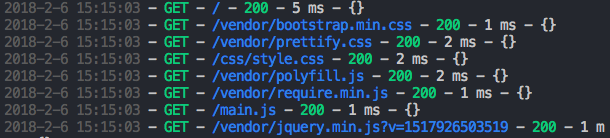

# koa-http-log

This module provide a Koa middleware logger that will display HTTP calls on your Koa app.

## Example :

```js
'use strict'

const Koa = require('koa')
const logger = require('koa-http-log')

const app = new Koa()

app.use(logger())
```
This example will display logs like this :



## Options :

You can use options :
```js
// Here are the default options :
const options = {
  deactivate: false,
  format: ['date', 'method', 'url', 'status', 'responseTime'],
  separator: ' - ',
}

app.use(logger(options))
```

- `deactivate` : Boolean. if `true` the logger will be inactive. (Default `false`)
- `format` : Array. Determine which fields are displayed in he logs. (Default ['date', 'method', 'url', 'status', 'responseTime'])
- `separator` : String. Determine which string is used to separate fields. (default to " - ")

## Fields available :
`date, host, method, url, path, responseTime , status , body`
